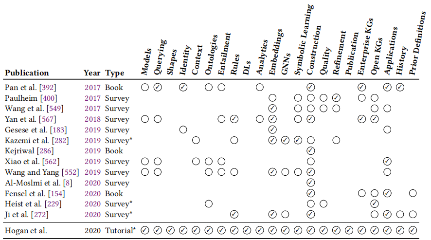
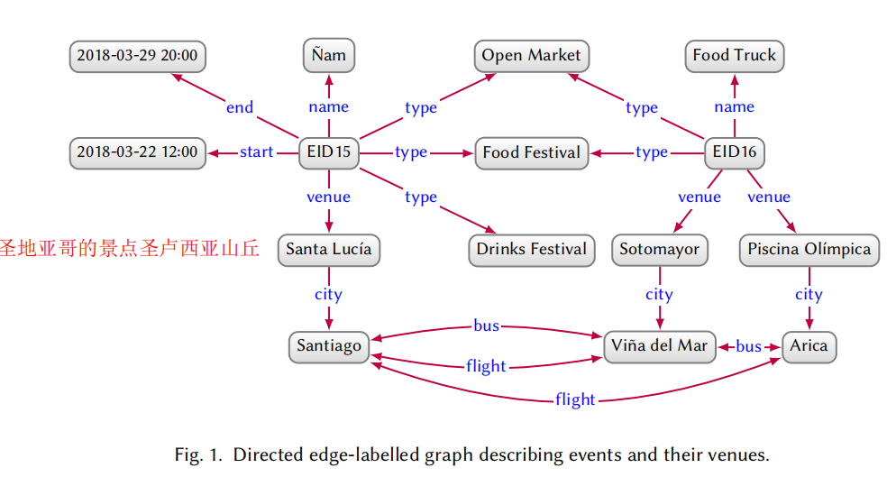

## 论文1
### 标题：《知识图谱研究综述》
### 信息：2017年，清华大学 计算机系 李涓子
### 内容：
0. 引言
   - 知识图谱：描述概念、实体、事件及其间的关系，谷歌2012年5月首推
   - 知识图谱技术：知识表示、知识图谱构建和知识图谱应用
     - 知识表示：表示与存储，使用和计算
     - 知识图谱构建：使用何种数据和方法抽取何种知识
     - 知识图谱应用：利用知识图谱建立基于知识的智能服务系统
1. 知识图谱资源
2. 知识表示：
   - 基于符号逻辑
   - 万维网内容：XML、RDF和OWL
   - 表示学习
3. 知识图谱构建技术
   - 概念层次学习
   - 事实学习
   - 语义集成
4. 应用
   - 语义搜索
   - 知识问答
   - 大数据分析与决策

## 论文2
### 标题：《知识图谱技术综述》
### 信息：2016年，电子科技大学 统计机器智能与学习实验室 徐增林
### 内容：
1. 知识图谱的定义与架构
   - 表示：G=(E,R,S)
   - 体系架构

2. 知识库
   - 开放链接知识库：Freebase、Wikidata、DBpedia、YAGO
   - 垂直行业知识库：IMDB、MusicBrainz、ConceptNet
3. 知识图谱的关键技术
   - 知识抽取(knowledge extraction)
     - 命名实体识别(named entity recognition)
     - 关系抽取
     - 属性抽取
   - 知识表示(knowledge representation)：深度学习
     - 距离模型
     - 单层神经网络模型
     - 双线性模型
     - 神经张量模型
     - 矩阵分解模型
     - 翻译模型
   - 知识融合(knowledge fusion)
     - 实体对齐(entity alignment)
     - 知识加工
     - 知识更新
   - 知识推理(knowledge reasoning)
     - 基于逻辑
     - 基于图
4. 典型应用
   - 智能搜索
   - 深度问答
   - 社交网络
   - 垂直行业应用
5. 知识图谱的挑战
   - 知识获取
   - 知识表示
   - 知识融合
   - 知识应用

## *论文3*
### 标题：《知识图谱研究进展》
### 信息：2017年，东南大学 计算机 漆桂林
### 内容：
1. 介绍
semantic network：基于图的数据结构
2. 知识图谱构建技术
   - 技术地图

   - 实体关系识别
   - 知识融合技术
   - 实体链接技术
   - 知识推理技术
3. 开放知识图谱

## Paper 4
### 标题：Knowledge graphs
### 信息：
### 内容：
1. Introduction
   - The goal
     - [ ] to describe the foundational data models and how they can be queried
     - [ ] to discuss representations relating to schema,identity,and context
     - [ ] to discuss deductive and inductive ways(演绎和归纳方法) to make knowledge explicit
     - [ ] to present a variety of techniques that can be used for the creation and enrichment of graph-structured data
     - [ ] to describe how the quality of knowledge graphs can be discerned(识别) and how they can be refined
     - [ ] to discuss standards and best practices by which knowledge graphs can be published
     - [ ] to provide an overview of existing knowledge graphs found in practice
   - Definition  
      *A graph of data* intended to accumulate and convey knowledge of the real world,whose **nodes** represent entities of interest and whose **edges** represent relations between these entities.
   - Two types  
      *open knowledge graphs* and *enterprise knowledge graphs*
   
2. Data graphs
   - Models
     - relational model
     - directed edge-labelled graphs(multi-relational graph) $\longrightarrow$A standardised data model:**Resource Description Framework(RDF)**  
         a set of nodes(represent entities) and a set of directed labelled edges(represent relations) between those nodes.
         
     - heterogeneous graphs(heterogeneous information network)  
         each node and edge is assigned one type,an edge is called homogeneous(same type nodes) or heterogeneous(different type nodes).
         
     - property graphs  
         a set of *property-value* pairs and a *label* to be associated with both nodes and edges.
     - graph dataset  
         a set of *named graphs*(a graph ID and a graph) and a *default graph*(a graph without an ID).
     - other graph data models  
         complex nodes that may contain individual edges or nested graphs.
     - graph stores  
         NoSQL(Not only SQL)
   - Querying  
     SPARQL for RDF;Cypher,Gremlin and C_CORE for property graphs.
     - graph patterns  
       generating mappings from the variables of the graph pattern to constants in the data graphs.
     - complex graph patterns  
         using the relational algebra to combine and/or transform tables.
     - navigational graph patterns
     - other features
3. Schema,identity,context  
   various enhancements and extensions of the data graph.

## 论文5
### 题目：知识图谱构建技术综述
### 信息：刘峤,2015年,电子科技大学信息与软件工程学院
### 内容：
1. 知识图谱的定义与架构  
   定义：**结构化**的语义知识库，基本组成单位是“实体-关系-实体”三元组，以及实体的“属性-值”对。  
   逻辑结构：数据层（知识以事实为单位存储在图数据库）和**模式层**（采用本体库管理的经过提炼的知识）
   技术架构：信息抽取、知识融合、知识加工
2. 知识图谱的构建技术  
   信息抽取：抽取实体、关系以及实体属性等结构化的信息
      - 实体抽取（NER，named entity recognition）：基于规则$\rightarrow$统计机器学习$\rightarrow$
      - 关系抽取
      - 属性抽取  
   知识融合：消除概念的歧义，剔除冗余和错误概念，确保知识的质量
      - 实体链接：抽取到的实体对象链接到知识库中对应的实体对象
        - 实体消歧entity disambiguation：根据当前的语境准确建立实体链接
        - 共指消解entity resolution：对象对齐object alignment、实体匹配entity matching、实体同一entity synonyms
      - 知识合并：
        - 合并外部知识库
        - 合并关系数据库
   知识加工：从事实当中获取知识
      - 本体构建
      - 知识推理：基于逻辑的推理和基于图的推理
      - 质量评估
   知识更新
3. 知识图谱的应用

## 论文6
### 题目：大规模结构化知识的表示学习、自动获取与计算应用
### 信息：林衍凯,2019年,清华大学博士论文
### 内容：
知识图谱：人类知识**结构化**形成的知识系统，面向**开放领域和垂直领域**，用三元组(head entity,relation,tail entity)形式表示实体间的复杂关系。  

自然语言处理：规则驱动和数据驱动
   - 规则驱动：语言由规则产生和描述
   - 数据驱动：从大规模语言数据中自动学习总结语言模型

基于**深度学习**的自然语言处理：2013年word2vec、2018年BERT预训练语言模型，利用大规模**无标注文本数据**学习通用的语言知识
   