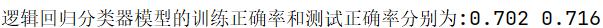
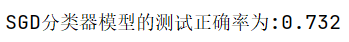

## 实验报告
### 1. 数据预处理
本次实验的4个数据集前60条数据均存在缺失值，考虑到数据集规模较大且车辆起步过程对路面情况和驾驶风格的判断影响不大，所以对前60条数据均采取删除处理，对数据集中其他的缺失值全部填0，所以最终的数据集规模为(24717,17).

逻辑回归中使用了随机梯度上升的方法求解模型参数，所以调用了`sklearn.preprocessing.StandardScaler`类对训练数据进行了标准化处理，即：
$$x=\frac{x-\mu}{\sigma}$$
### 2. 数据集划分
本次实验对数据集shuffle后调用`sklearn.model_selection.train_test_split`类对数据集按**训练集:测试集=9:1**的比例进行了随机划分，即训练集规模(22445,14)，测试集规模(2472,14).
### 3. 性能评价指标
在路面情况和驾驶风格推测任务中均选择了分类正确率作为性能评价指标，即：
$$score=\frac{N_{correct}}{N_{total}}$$
### 4. 实验结果
- 路面情况推测  
  路面情况判断使用逻辑回归实现三分类，一个逻辑回归分类器只能实现二分类，所以采用了OvR的方法定义了两个个逻辑回归分类器实现三分类，在逻辑回归参数求解中使用了随机梯度上升的方法进行迭代：
  $$\omega\leftarrow\omega+\alpha\frac{\partial L}{\partial \omega}=\omega+\alpha X^T(y-\widehat{y})$$
  实验中，选择学习步长$\alpha=0.001$，迭代次数$iter\_nums=2000$，批量大小$batch\_size=100$时得到了模型性能评价指标为：  
    
  另外，本次实验还调用了`sklearn.linear_model.SGDClassifier`类实现了逻辑回归分类器并进行了对比，得到的分类准确率约为0.73.  
    
- 驾驶风格推测  
  驾驶风格推测使用高斯概率生成模型实现了二分类，训练得到了两个高斯先验概率分布$P(x|y=0)$和$P(x|y=1)$，然后通过比较后验概率的大小实现二分类。模型的性能评价指标如下：  
    
