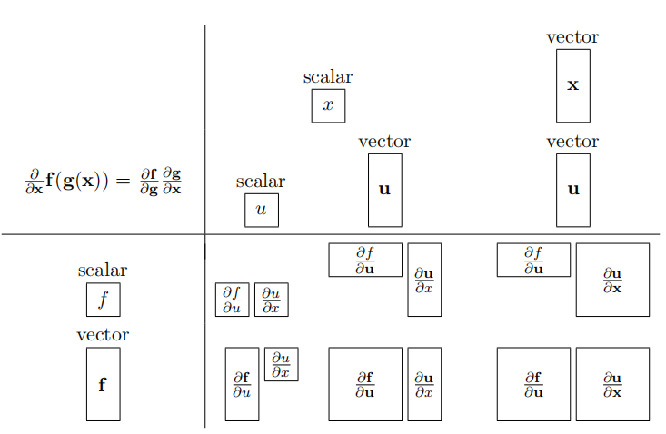

## 向量微分
$\frac{\partial F}{\partial X}$的表达式根据$F$和$X$的类型（标量、向量、矩阵）有不同的表示方式，通常有两种布局模式：分子布局（numerator layout）和分母布局（denominator layout），本质上就是按F或X的向量类型（列向量或横向量）对结果进行排列，两种布局互为转置.

1. 向量求导   
   假设标量$x$和$f$，向量$X=(x_1,x_2,...,x_n)^T$和$F=(f_1(X),f_2(X),...,f_m(X))^T$，采取分子布局模式，则：
   - 标量对标量求导
    $$\frac{\partial f}{\partial x}$$
   - 向量对标量求导
    $$\frac{\partial F}{\partial x}=(\frac{\partial f_1(x)}{\partial x},\frac{\partial f_2(x)}{\partial x},..,\frac{\partial f_m(x)}{\partial x})^T$$
   - 标量对向量求导
    $$\frac{\partial f}{\partial X}=(\frac{\partial f}{\partial x_1},\frac{\partial f}{\partial x_2},...,\frac{\partial f}{\partial x_n})$$
   - 向量对向量求导
    $$\frac{\partial F}{\partial X}=\begin{bmatrix}
          \frac{\partial f_1}{\partial x_1}&...&\frac{\partial f_1}{\partial x_n}\\
          ...&...\\
          \frac{\partial f_m}{\partial x_1}&...&\frac{\partial f_m}{\partial x_n}\\
          \end{bmatrix}$$

2. 向量**按位(element-wise)二元运算**求导  
   假设$W=(\omega_1,\omega_2,...,\omega_n)^T,X=(x_1,x_2,...,x_n)^T$，则：
   - 按位+
    $$\frac{\partial (W+X)}{\partial W}=diag(1,1,...,1)=I_n$$
    $$\frac{\partial (W+X)}{\partial X}=diag(1,1,...,1)=I_n$$
   - 按位-
    $$\frac{\partial (W-X)}{\partial W}=diag(1,1,...,1)=I_n$$
    $$\frac{\partial (W-X)}{\partial X}=diag(-1,-1,...,-1)=-I_n$$
   - 按位*
    $$\frac{\partial (W\times X)}{\partial W}=diag(x_1,x_2,...,x_n)=diag(X)$$
    $$\frac{\partial (W\times X)}{\partial X}=diag(\omega_1,\omega_2,...,\omega_n)=diag(W)$$
   - 按位/
    $$\frac{\partial (W/X)}{\partial W}=diag(\frac{1}{x_1},\frac{1}{x_2},...,\frac{1}{x_n})$$
    $$\frac{\partial (W/X)}{\partial X}=diag(-\frac{\omega_1}{x_1^2},-\frac{\omega_2}{x_2^2},...,-\frac{\omega_n}{x_n^2})$$
  
3. 向量与标量运算的偏导  
   向量与标量的运算首先将标量扩展为同维向量，然后进行按位操作.  
   - 相加求偏导
    $$\frac{\partial (X+z)}{\partial X}=diag(1,1,...,1)=I_n$$
    $$\frac{\partial (X+z)}{\partial z}=(1,1,...,1)^T$$
   - 相乘求偏导
    $$\frac{\partial (Xz)}{\partial X}=diag(z,z,...,z)=zI_n$$
    $$\frac{\partial (Xz)}{\partial z}=(x_1,x_2,...,x_n)^T=X$$

4. 利用向量和降维  
   假设$y=sum(F(X))=\sum_{i=1}^mf_i(X)$，则：
   $$\begin{aligned}
      \frac{\partial y}{\partial x} &=(\frac{\partial y}{\partial x_1},\frac{\partial y}{\partial x_2},...,\frac{\partial y}{\partial x_n}) \\
      &=(\frac{\partial}{\partial x_1}\sum_if_i(X),\frac{\partial}{\partial x_2}\sum_if_i(X),...,\frac{\partial}{\partial x_n}\sum_if_i(X)) \\
      &=(\sum_i\frac{\partial f_i(X)}{\partial x_1},\sum_i\frac{\partial f_i(X)}{\partial x_2},...,\sum_i\frac{\partial f_i(X)}{\partial x_n})
   \end{aligned}$$

5. 链式法则
   - 单变量链式法则
    $$\frac{dy}{dx}=\frac{dy}{du}\frac{du}{dx}$$
   - 单变量全微分链式法则
    $$\frac{\partial f(x,u_1,u_2,...u_n)}{\partial x}=\frac{\partial f}{\partial x}+\frac{\partial f}{\partial u_1}\frac{\partial u_1}{\partial x}+...+\frac{\partial y}{\partial u_n}\frac{\partial u_n}{\partial x}=\frac{\partial f}{\partial x}+\sum_{i=1}^n\frac{\partial f}{\partial u_i}\frac{\partial u_i}{\partial x}$$
    不妨设$u_{n+1}=x$，则上式简化为：
    $$\frac{\partial f(u_1,...u_n,u_{n+1})}{\partial x}=\sum_{i=1}^{n=1}\frac{\partial f}{\partial u_i}\frac{\partial u_i}{\partial x}=\frac{\partial f}{\partial U}·\frac{\partial U}{\partial x}$$
    其中$U=(u_1,u_2,...,u_n,x)^T$
   - 向量链式法则
    $$\frac{\partial F(G(X))}{\partial X} = \frac{\partial F}{\partial G}·\frac{\partial G}{\partial X}=\begin{bmatrix}
       \frac{\partial f_1}{\partial g_1}&...&\frac{\partial f_1}{\partial g_k}\\
       ...&...\\
       \frac{\partial f_m}{\partial g_1}&...&\frac{\partial f_m}{\partial g_k}\\
    \end{bmatrix}_{m\times k}·\begin{bmatrix}
       \frac{\partial g_1}{\partial x_1}&...&\frac{\partial g_1}{\partial x_n}\\
       ...&...\\
       \frac{\partial g_k}{\partial x_1}&...&\frac{\partial g_k}{x_n}\\
    \end{bmatrix}_{k\times n}$$
    

6. 向量点乘求导  
   两个向量点乘$y=W·X=W^TX$可以写成复合函数：$y=sum(U)=sum(W\times X)$，即先按位相乘再对向量求和，对其求导：
   $$\frac{\partial y}{\partial W}=\frac{\partial (W·X)}{\partial W}=\frac{\partial y}{\partial U}\frac{\partial U}{\partial W}=\frac{\partial y}{\partial U}\frac{\partial (W\times X)}{\partial W}=(1,1,...,1)^Tdiag(X)=X^T$$
   神经元激活函数$activation=max(0,W·X+b)$求导：
   $$\frac{\partial activation}{\partial W}=\begin{cases}
      0&&&W·X+b\leq0\\
      X^T&&&W·X+b>0\\
   \end{cases}$$
   $$\frac{\partial activation}{\partial b}=\begin{cases}
      0&&&W·X+b\leq0\\
      1&&&W·X+b>0\\
   \end{cases}$$

7. 损失函数的梯度  
   输入数组：
   $$X=(X_1,X_2,...,X_N)^T=\begin{bmatrix}
      x_{11}&...&x_{1n}\\
      ...&...\\
      x_{N1}&...&x_{Nn}\\
   \end{bmatrix}$$
   输出值：
   $$Y=(y_1,y_2,...,y_N)^T=X·W+b$$
   损失函数：
   $$J(W,b)=\frac{1}{N}\sum_{i=1}^N(y_i-activation(X_i))^2=\frac{1}{N}\sum_{i=1}^N[y_i-max(0,W·X_i+b)]^2$$
   损失函数的梯度：
   $$\frac{\partial J}{\partial W}=\begin{cases}
      0&&&W·X_i+b\leq0\\
      \frac{2}{N}\sum_{i=1}^N(W·X_i+b-y_i)X_i^T&&&W·X_i+b>0
   \end{cases}$$
   $$\frac{\partial J}{\partial b}=\begin{cases}
      0&&&W·X_i+b\leq0\\
      \frac{2}{N}\sum_{i=1}^N(W·X_i+b-y_i)&&&W·X_i+b>0
   \end{cases}$$
   定义误差$e_i=W·X_i+b-y_i$，则：
   $$\frac{\partial J}{\partial W}=\frac{2}{N}\sum_{i=1}^Ne_iX_i^T$$
   $$\frac{\partial J}{\partial b}=\frac{2}{N}\sum_{i=1}^Ne_i$$
   在梯度下降法求解损失函数最小值时，每次在**梯度反方向**进行迭代，即：
   $$W_{t+1}=W_t-\eta\frac{\partial J}{\partial W}$$
   $$b_{t+1}=b_t-\eta\frac{\partial J}{\partial b}$$
   在实际运算中，可以通过添加哑元将$b$合并到$W$，即：
   $$W·X_i+b=\widehat{W}·\widehat{X}_i=\begin{bmatrix}
      w_1\\
      ...\\
      w_n\\
      b
   \end{bmatrix}·\begin{bmatrix}
      x_{i1}\\
      ...\\
      x_{in}\\
      1
   \end{bmatrix}$$

## 最小二乘法  
   在线性回归中，损失函数定义为：
   $$J(\boldsymbol{\omega})=\frac{1}{N}\sum_{i=1}^N[y_i-(\boldsymbol{\widehat{\omega}}^T\boldsymbol{\widehat{x}_i})]^2=\frac{1}{N}(\boldsymbol{X·\omega-y})·(\boldsymbol{X·\omega-y})=\frac{1}{N}(\boldsymbol{X\omega-y})^T(\boldsymbol{X\omega-y})$$
   利用最小二乘法求上述函数的最小值，首先对$\boldsymbol{\omega}$求导数，不妨设$\boldsymbol{u=X·\omega-y}$，则：
   $$\frac{\partial J}{\partial\boldsymbol{\omega}}=\frac{1}{N}\frac{\partial\boldsymbol{u·u}}{\partial\boldsymbol{\omega}}=\frac{2}{N}X^T\boldsymbol{u}=\frac{2}{N}X^T(\boldsymbol{X·\omega-y})=0$$
   整理上式，得到：
   $$\boldsymbol{X^TX\omega=X^Ty}$$
   即：
   $$\boldsymbol{\omega=(X^TX)^{-1}X^Ty}$$
   从另一角度考虑，线性模型学习中的目标是求出一组参数$\boldsymbol{\omega}$使得误差$e=0$：
   $$\boldsymbol{y=X\omega+e}$$
   此时有：
   $$\boldsymbol{\omega=A^\dagger y}$$
   使用伪逆矩阵求线性模型的最优解时不需要考虑的$X$的可逆性，因为任意矩阵的伪逆矩阵必然存在且唯一.
   
   **广义逆矩阵(generalized inverse)**  
   矩阵$A_{m\times n}$，如果存在矩阵$G_{n\times m}$，满足：
   $$AGA=A$$
   则矩阵$G$为A的广义逆矩阵（广义逆矩阵一定存在但不唯一）.  

   **伪逆矩阵(pseudoinverse/Moore-penrose inverse)**  
   伪逆矩阵是受约束的广义逆矩阵，满足下列条件：
   - $ABA=A   \leftarrow$B是A的广义逆矩阵
   - $BAB=B   \leftarrow$A是B的广义逆矩阵
   - $(AB)^T=(AB)   \leftarrow$AB是对称阵
   - $(BA)^T=(BA)   \leftarrow$BA是对称阵  

   则矩阵$B$为矩阵$A$的伪逆矩阵（伪逆矩阵一定存在且唯一）.

   **奇异值分解(Singular value decomposition)**  
   奇异值分解可以用来求解矩阵的伪逆矩阵.  
   - 列满秩矩阵的伪逆矩阵  
    矩阵$A_{m\times n}$列满秩且$n\leq m$，则其伪逆矩阵：
   $$A^\dagger=(A^TA)^{-1}A^T$$  
   - 对角矩阵的伪逆矩阵  
    对角阵$A_{m\times n}$的伪逆矩阵$A^\dagger=B_{n\times m}$，矩阵元素满足：
   $$b_{ii}=\begin{cases}
      \frac{1}{a_{ii}}&&,&a_{ii}\neq0\\
      0&&,&a_{ii}=0\\
   \end{cases}$$
   - 任意矩阵的伪逆矩阵  
    任意矩阵$A_{m\times n}$的SVD分解为$A=U\Sigma V^T$，则其伪逆矩阵：
   $$A^\dagger=V\Sigma^\dagger U^T$$
## 梯度下降法(Gradient Descent)
梯度下降法是求解无约束问题极值的基本方法，主要原理是**泰勒级数展开和梯度方向函数值变化最快**，当目标函数是凸函数（下凸）时梯度下降的解释全局解。

## 牛顿法

1. 牛顿法  
   对单变量的无约束优化问题：
   $$\mathop{min}\limits_{x}f(x)$$
   假设$f(x)$具有二阶连续导数，则在$x=x_k$处的二阶泰勒展开式为：
   $$f(x)\approx f(x_k)+f'(x_k)(x-x_k)+\frac{1}{2!}f''(x_k)(x-x_k)^2$$
   函数$f(x)$的极值点满足$f'(x)=0$，所以对上式求导：
   $$\frac{df}{dx}\approx f'(x_k)+f''(x_k)(x-x_k)=0$$
   得：
   $$x_{k+1}=x_k-\frac{f'(x_k)}{f''(x_k)}$$
   通过给定$x_0$，反复使用上式进行迭代即可找到最优解.

   将单变量的无约束优化问题推广到**向量空间**：
   $$\mathop{min}\limits_{x\in R^n}f(\boldsymbol{x})$$
   假设$f(\boldsymbol{x})$具有二阶连续偏导数，则在$\boldsymbol{x=x_k}$处的二阶泰勒展开式为：
   $$f(\boldsymbol{x})\approx f(\boldsymbol{x_k})+\nabla f(\boldsymbol{x_k})^T(\boldsymbol{x-x_k})+\frac{1}{2!}\boldsymbol{(x-x_k)^TH(x_k)(x-x_k)}$$
   其中，$Hessian$矩阵为$f(\boldsymbol{x_k})$的二阶导数：
   $$H(x_k)=\nabla^2f(\boldsymbol{x_k})=\begin{bmatrix}
      \frac{\partial^2 f}{\partial x_1^2}&...&\frac{\partial^2 f}{\partial x_1\partial x_n}\\
      ...&...\\
      \frac{\partial^2 f}{\partial x_n\partial x_1}&...&\frac{\partial^2 f}{\partial x_n^2}\\
   \end{bmatrix}$$
   同理，对上式求偏导：
   $$\nabla f(\boldsymbol{x})\approx \nabla f(\boldsymbol{x_k})+\boldsymbol{H(x_k)(x-x_k)}=0$$
   得：
   $$\boldsymbol{x_{k+1}=x_k-H(x_k)^{-1}\nabla f(x_k)}$$
   通过指定初始值$\boldsymbol{x_0}$，利用上式进行迭代即可找到极值点.

2. 拟牛顿法  
   牛顿法存在的主要问题是Hessian矩阵计算比较复杂且不一定可逆，拟牛顿法通过构造近似Hessian矩阵或其逆矩阵的正定对称矩阵，用该矩阵进行迭代.