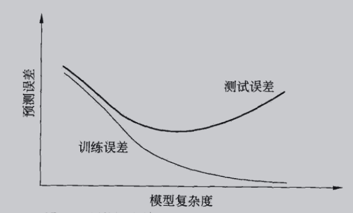
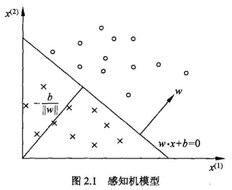
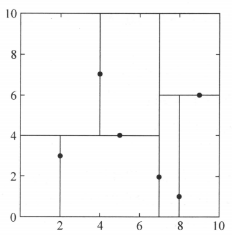
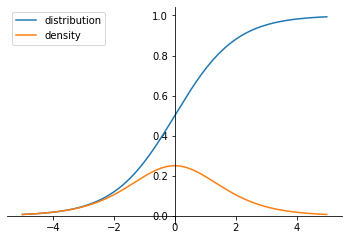

- [1 统计学习方法](#1-统计学习方法)
  - [1.1 统计学习](#11-统计学习)
  - [1.2 监督学习](#12-监督学习)
  - [1.3 统计学习三要素](#13-统计学习三要素)
  - [1.4 模型评估与模型选择](#14-模型评估与模型选择)
  - [1.5 正则化与交叉验证](#15-正则化与交叉验证)
  - [1.6 泛化能力](#16-泛化能力)
  - [1.7 生成模型和判别模型](#17-生成模型和判别模型)
  - [1.8 分类问题](#18-分类问题)
  - [1.9 标注问题](#19-标注问题)
  - [1.10 回归问题](#110-回归问题)
- [2 感知机（Perceptron）](#2-感知机perceptron)
  - [2.1 感知机模型](#21-感知机模型)
  - [2.2 感知机学习策略](#22-感知机学习策略)
  - [2.3 感知机学习算法](#23-感知机学习算法)
- [3 $k$近邻(k-nearest neighbor,KNN)](#3-k近邻k-nearest-neighborknn)
  - [3.1 k近邻算法](#31-k近邻算法)
  - [3.2 k近邻模型](#32-k近邻模型)
  - [3.3 k近邻的算法实现：kd树](#33-k近邻的算法实现kd树)
- [4 朴素贝叶斯法](#4-朴素贝叶斯法)
  - [4.1 朴素贝叶斯的学习与分类](#41-朴素贝叶斯的学习与分类)
  - [4.2 朴素贝叶斯的参数估计](#42-朴素贝叶斯的参数估计)
- [5 决策树](#5-决策树)
  - [5.1 决策树模型与学习](#51-决策树模型与学习)
  - [5.2 特征选择](#52-特征选择)
  - [5.3 决策树的生成](#53-决策树的生成)
  - [5.4 决策树的剪枝(pruning)](#54-决策树的剪枝pruning)
  - [5.5 CART(classification and regression tree)算法](#55-cartclassification-and-regression-tree算法)
- [6 Logistic回归与最大熵模型](#6-logistic回归与最大熵模型)
  - [6.1 Logistic回归模型](#61-logistic回归模型)
  - [6.2 最大熵模型(maximum entropy model)](#62-最大熵模型maximum-entropy-model)
  - [6.3 模型学校的最优化算法](#63-模型学校的最优化算法)
- [7 支持向量机(support vector machines)](#7-支持向量机support-vector-machines)
  - [7.1 线性可分支持向量机与硬间隔最大化](#71-线性可分支持向量机与硬间隔最大化)
## 1 统计学习方法
### 1.1 统计学习
1. 概念：基于**数据**，构建**概率统计模型**，进行**预测与分析**
2. 对象：**数据**
3. 目的：**分析和预测**
4. 方法：**监督学习**、非监督学习、半监督学习、强化学习
5. 步骤：
   - 有限数据集
   - 确定假设空间（学习模型的集合）
   - 确定模型选择的原则（学习策略）
   - 实现求解最优模型的算法
   - 通过学习选择最优模型
   - 使用最优模型进行分析预测
6. 应用：分类、标注、回归
### 1.2 监督学习
1. 基本概念
   - 输入空间
   - 输出空间
   - 特征空间
   - 训练数据
   - 联合概率分布：$P(X,Y)$
   - 假设空间：模型的集合
2. 问题的形式化
### 1.3 统计学习三要素  
**方法=模型+策略+算法**
1. 模型
   - 条件概率分布：$P(Y|X)$
   - 决策函数：$y=f_\theta(X)$
2. 策略  
**选最优模型的原则**
   - 损失函数（代价函数）：评价模型的错误程度
      - 0-1损失函数：$L(Y,f(X))=\begin{cases}
            1,\,\,Y \neq f(X) \\
            0,\,\, Y = f(X)
        \end{cases}$
      - 平方损失函数：$L(Y,f(X))=(Y-f(X))^2$
      - 绝对损失函数：$L(Y,f(X))=|Y-f(X)|$
      - 对数损失函数：$L(Y,P(Y|X))=-logP(Y|X)$
    - 风险函数：损失函数的期望
      $$R_{exp}(f)=E_p[L(Y,f(X))]=\int_{x\times y}L(y,f(x))P(x,y)dxdy$$
    - 经验风险：由训练集得到的平均损失
        $$R_{emp}(f)=\frac{1}{N}\sum_{i=1}^NL(y_i,f(x_i))$$
    - 模型选择原则：风险最小化
      - 经验风险最小化：样本容量很小时经验风险不能有效估计风险函数（不满足大数定律），会产生“过拟合”
        $$min\{R_{emp}(f)\}$$
      - 结构风险最小化：在经验风险的基础上加入正则化控制模型的复杂度$J(f)$
        $$min\{R_{srm}(f)\}$$
        $$R_{srm}(f)=R_{emp}(f)+\lambda J(f)$$
3. 算法  
学习算法就是求解风险最小化的模型参数
### 1.4 模型评估与模型选择
1. 训练误差与测试误差
   - 训练误差：模型在训练集($N$)上的平均损失
      $$R_{emp}(\widehat{f})=\frac{1}{N}\sum_{i=1}^{N}L(y_i,\widehat{f}(x_i))$$
   - 测试误差：模型在测试集($N^{'}$)上的平均损失
      $$R_{test}(\widehat{f})=\frac{1}{N^{'}}\sum_{i=1}^{N^{'}}L(y_i,\widehat{f}(x_i))$$
2. 过拟合与模型选择
   - 过拟合：模型在训练集中表现较好，但泛化能力差
   - 模型复杂度：
)
### 1.5 正则化与交叉验证
1. 正则化
$$min\frac{1}{N}\sum_{i=1}^NL(y_i,f(x_i))+\lambda J(f)$$
2. 交叉验证  
随机将数据集切分：**训练集、验证集和测试集**
   - 简单交叉验证
   - K折交叉验证
   - 留一交叉验证
### 1.6 泛化能力
1. 泛化误差
   $$R_{exp}(\widehat{f})=E_{p}[L(Y,\widehat{f}(X))]=\int_ {X\times Y}L(Y,\widehat{f}(X))P(x,y)dxdy$$ 
2. 泛化误差上界  
是关于**样本容量和假设空间**的函数，样本容量增加时泛化上界趋于0；假设空间越大，泛化误差上界越大。
### 1.7 生成模型和判别模型
1. 生成模型  
从训练数据学习联合概率分布$P(X,Y)$，然后求出条件概率分布$P(Y|X)$作为预测的模型
2. 判别模型  
从训练数据学习决策函数$f(X)$
### 1.8 分类问题
输出变量取值为**离散值**。
1. 评价指标
   - 分类准确率
   - 精确率和召回率
   - $F_1$值
### 1.9 标注问题
### 1.10 回归问题

## 2 感知机（Perceptron）
感知机是**二分类的线性分类模型**，输入为特征向量，输出为类别（取+1和-1），旨在求出将训练数据进行线性划分的分离超平面。
### 2.1 感知机模型
输入$\vec{x}\in X(X\subseteq{R^{n}})$，输出$y=\{-1,1\}$，由输入空间到输出空间的函数$f(x)$称为感知机：
$$f(x)=sign(\vec{w}·\vec{x}+b)$$
$\vec{\omega}为权值向量$，$b$为偏置，$sign$是符号函数，即：
$$sign(x)=\begin{cases}+1,\,x\geq0\\
-1,\,x<0\\
\end{cases}$$
线性方程$\vec{w}·\vec{x}+b=0$是特征空间$R^n$的一个超平面，将特征空间划分为两部分，超平面S称为**分离超平面**.  

### 2.2 感知机学习策略
1. 数据集的线性可分性  
存在**超平面S**能将数据集中的点完全正确的划分到平面两侧
2. 感知机学习策略
   - 损失函数：误分类点到超平面的总距离
    $$-\frac{1}{||\omega||}\sum_{x_i\in M}y_i(\vec{\omega}·\vec{x_i}+b)$$
      由于$||\omega||$为常数，所以定义感知机学习的损失函数为：
      $$L(\omega,b)=-\sum_{x_i\in M}y_i(\vec{\omega}·\vec{x_i}+b)$$
    > 点到超平面的距离公式：
    > 假设$x_1$为$x_0$在超平面的投影，则$\vec{\omega}·\vec{x_1}+b=0$，此时$\vec{x_0x_1}$与法向量$\vec{\omega}$平行，所以：
    > $$|\vec{\omega}·\vec{x_0x_1}|=||\omega||d$$
    > 根据向量点乘公式展开，化简可得距离公式：
    > $$d=\frac{1}{||\omega||}|\vec{\omega}·\vec{x_0}+b|$$
    > 在误分类中，$y_i=-1$的点被估计为$\vec{\omega}·\vec{x_0}+b>0$，反之也成立，因此距离公式可写为：
    > $$-y_i(\vec{\omega}·\vec{x_0}+b)$$
### 2.3 感知机学习算法  
   感知机学习的策略是找到使损失函数最小的模型参数$\omega,b$，因此感知机学习问题转换为损失函数的最优化问题，最优化的方法是**随机梯度下降法(stochastic gradient descent)**
   > **梯度下降法**  
    > 由泰勒展开式：
    > $$f(x+\Delta x) \approxeq f(x)+\Delta x\nabla f(x)$$
    > 要使$f(x+\Delta x)<f(x)$，上式应满足$\Delta x\nabla f(x)<0$，令：$\Delta x =-\alpha \nabla f(x)(\alpha >0)$，$\alpha$为迭代步长，此时
    > $$\Delta x\nabla f(x)=-\alpha(\nabla f(x))^2<0$$
    > 因此，在梯度下降算法中，需要选择初始值$x$和迭代步长$\alpha$进行迭代运算，直到达到条件停止。  
    > **学习率**  
    > 上述定义的迭代步长$\alpha$即为学习率，是一个超参数。  
    > **多维梯度下降**  
    > 当目标函数的输入是一个$d$维向量$\vec{x}=[x_1,x_2,...,x_d]^T$时，梯度表示如下：
    > $$\nabla_xf(\vec{x})=[\frac{\partial f(\vec{x})}{\partial x_1},\frac{\partial f(\vec{x})}{\partial x_2},...,\frac{\partial f(\vec{x})}{\partial x_d}]^T$$
    > 已知沿梯度方向函数值增加最快，沿梯度反方向函数值减少最快，所以选择$\Delta \vec{x}=-\alpha \nabla_x f(\vec{x})$进行迭代运算。  
    > **随机梯度下降**  
    > 在机器学习中，损失函数通常是数据集中各样本损失函数的均值，使用梯度下降法迭代时每次的计算开销为$O(n),n$为数据集容量，在数据集很大时迭代计算开销线性增加。随机梯度下降在每次迭代中随机采样一个样本计算梯度进行迭代，使计算开销从$O(n)$降为$O(1)$。实际上，随机梯度是对梯度的无偏估计：
    > $$E_i\nabla f_i(\vec{x})=\frac{1}{n}\sum_{i=1}^{n}\nabla f_i(\vec{x})=\nabla f(\vec{x})$$
1. 感知机模型
     - 输入：数据集$T=\{(x_1,y_1),...,(x_N,y_N)\}$，学习率$\eta$
     - 模型：$f(x)=sign(\vec{\omega}·\vec{x}+b)$
     - 输出：$\vec{\omega},b$，满足$minL(\vec{\omega},b)$
     - 风险函数：$L(\omega,b)=-\sum_{x_i\in M}y_i(\vec{\omega}·\vec{x_i}+b),M$为误分类集合
2. 感知机学习算法的原始形式
     - 选取初始值$\omega_0,b_0$
     - 在训练集中随机选取数据$(x_i,y_i)$，满足$y_i(\omega·x_i+b)\leq 0$，则为误分类点，进行迭代运算
     - 计算梯度$\nabla_\omega L(\omega,b)=-\sum_{x_i\in M}y_ix_i$和$\nabla_b L(\omega,b)=-\sum_{x_i\in M}y_i$
     - 迭代$\omega \leftarrow \omega + \eta y_ix_i$和$b \leftarrow b + \eta y_i$
     - 循环进行迭代，直到训练集中没有误分类点
3. 算法收敛性  
线性可分数据集感知机学习算法原始形式**收敛**，即经过有限次迭代可以得到一个将数据集完全正确划分的分离超平面和感知机模型。
4. 感知机学习算法的对偶形式  
根据算法的原始形式，取初始值$\omega_0=0,b_0=0$，则$\omega$和$b$可以表示为$(x_i,y_i)$的线性组合，即
   $$\omega =\sum_{i=1}\alpha_iy_ix_i$$
   $$b=\sum_{i=1}\alpha_iy_i$$
   其中，$\alpha_i=n_i\eta,n_i$表示第i个数据被修改的次数，所以对偶形式的迭代算法如下：
   - 选取初始值：$\alpha=0,b=0$
   - 在训练集中随机选取数据$(x_i,y_i)$，满足$y_i(\sum_{j=1}\alpha_jy_jx_j·x_i+b)\leq 0$，则为误分类点，进行迭代运算
   - 迭代$\alpha_i\leftarrow\alpha_i+\eta$和$b\leftarrow b+\eta y_i$ 
5. scikit-learn感知机算法  
   `class sklearn.linear_model.Perceptron`类实现了线性感知机分类模型

## 3 $k$近邻(k-nearest neighbor,KNN)
基本的分类和回归方法，在k近邻分类中，输入为特征向量，对应特征空间的点，输出为类别，可以取多类。
### 3.1 k近邻算法
给定数据集，对于新的输入实例，在训练集中找到与该实例**最邻近的k个数据**，按照k个数据中的分布对输入实例进行分类。
1. 模型
   - 输入：数据集$T=\{(x_1,y_1),...,(x_N,y_N)\}$，其中$x_i\in X\subseteq R^n,y_i\in Y=\{c_1,c_2,...,c_K\}$
   - 输出：实例所属的类
2. 算法
   - 根据设定好的距离度量，在训练集中找到最近邻的k个点，组成集合$N_k(x)$
   - 在$N_k(x)$中根据分类决策规则决定x的类型
   - k近邻法没有显示的学习过程，当$k=1$时，变为最近邻算法
### 3.2 k近邻模型
k近邻法主要是对输入特征空间进行划分，模型主要包括三个基本要素：距离度量、k值和分类决策规则。
1. 距离度量  
   k近邻模型的特征空间一般为n维实数向量空间$R^n$，可以使用欧氏距离、$L_p$距离(Minkowski距离)，**不同的距离度量确定的最近邻点不同**
   > **欧式距离**  
   > 空间中的两点$\vec{x}=(x_1,x_2,...,x_n)$和$\vec{y}=(y_1,y_2,...,y_n)$之间的欧式距离为：
   > $$d(x,y)=\sqrt{(x_1-y_1)^2+(x_2-y_2)^2+...+(x_n-y_n)^2}$$
   > **$L_p$距离**  
   > 空间中的两点$\vec{x}=(x_1,x_2,...,x_n)$和$\vec{y}=(y_1,y_2,...,y_n)$之间的$L_p$距离为：
   > $$L_p(x,y)=(\sum_{i=1}^n|x_i-x_j|^p)^{\frac{1}{p}}$$
   > 其中$p\geq1$，$p=1$时为曼哈顿距离，$p=2$时为欧氏距离
2. k值得选择  
   k值选择较小（复杂模型），则学习的**近似误差**减小，但**估计误差**增大，容易发生过拟合；k值选择过大（简单模型），可以减少估计误差，但近似误差会增加。通常k选择较小的值并通过交叉验证的方法选取最优的k.
3. 分类决策规则  
   通常采用**多数表决**，相当于经验风险最小化.
### 3.3 k近邻的算法实现：kd树
k近邻的主要问题是对训练集进行**快速k近邻搜索**，最简单的方法是线性扫描，但计算复杂度非常高。
1. 构造$kd(k-dimension)$树  
   kd树是**二叉树**，是对k维空间的划分，用垂直于坐标轴的超平面对k维空间中的数据集进行切分，每次切分会有一个实例点落在切分线上并作为该层子节点，直到切分后的区域只包含一个实例点，该实例点作为叶子节点（代表一个区域）.通常**依次选择坐标轴**进行切分，选择**数据集在切分轴上的中位数**(数据集按切分轴排序，索引$\lfloor len(n)/2\rfloor$的实例)为切分点.
   - 开始：构造根节点，用k维空间的第1个坐标轴上的中位数进行切分，落在该切分线上的实例作为根节点，小于中位数的数据集落在左叶子节点，大于中位树的数据集落在右叶子节点
   - 重复：对深度为i的节点，用第(i%k+1)个坐标轴的中位数进行切分，直到切分后的区域只包含一个实例时停止切分，形成kd树.  
   
2. 搜索kd树  
   对于一个新实例，首先找到包含该实例的叶节点，然后依次回退到父节点，不断查找与目标点最邻近的节点。
   - 在kd树种找到包含目标点的叶节点，将此叶节点作为“当前最近点”，此时最近邻点必然落在以目标点为中心、“当前最近点”为半径的圆内部
   - 递归向上回退，如果父节点对应的实例比“当前最近点”距离目标更近，则父节点作为“当前最近点”
   - 如果“当前最近点”的另一兄弟节点对应的区域与圆相交，则可能在另一子节点对应的区域存在更近邻点，移动到另一节点进行最近邻搜索
   - 如果如果“当前最近点”的另一兄弟节点对应的区域与圆不相交，继续向上回退

## 4 朴素贝叶斯法
朴素贝叶斯法是基于贝叶斯定理与特征条件独立假设的分类方法，对给定的数据集学习输入输出的联合概率分布，然后对新输入值**利用贝叶斯定理求出后验概率最大的输出**.
### 4.1 朴素贝叶斯的学习与分类
1. 基本方法  
   输入$\vec{X}$是定义在输入空间的**随机特征向量**，输出$Y$是在输出空间上的**随机变量**，朴素贝叶斯法通过数据集学习输入特征向量和输出的联合概率分布$P(x,y)$，由贝叶斯公式得：
   $$P(x,y)=P(Y=y)P(X=x|Y=y)$$
   其中$P(X=x|Y=y)=P(X_1=x_1,...,X_n=x_n|Y=y)$，朴素贝叶斯法**对条件概率分布作了条件独立性的假设，即特征向量的各分量之间保持独立**，于是条件概率变为：
   $$P(X_1=x_1,...,X_n=x_n|Y=y)=\prod_{i=1}^nP(X_i=x_i|Y=y)$$
   朴素贝叶斯法在学习到概率分布后，对新输入x通过取**后验概率**$P(Y=y|X=x)$最大的值作为分类输出：
   $$P(Y=y|X=x)=\frac{P(X=x|Y=y)P(Y=y)}{\sum_iP(X=x|Y=y_i)P(Y=y_i)}=\frac{P(Y=y)\prod_{i=1}^nP(X=x_i|Y=y)}{\sum_iP(Y=y_i)\prod_{j=1}^nP(X=x_j|Y=y_i)}$$
   上式中分母对所有$y$都是相同的，所有朴素贝叶斯学习方法的输出可表示为：
   $$y=arg maxP(Y=y|X=x)=arg max\{P(Y=y)\prod_{i=1}^nP(X=x_i|Y=y)\}$$
2. 后验概率最大化的含义  
   后验概率最大化等价于期望风险最小化.
### 4.2 朴素贝叶斯的参数估计
1. 极大似然估计
   假设输出空间$Y={c_1,c_2,...,c_k}$，则朴素贝叶斯学习的本质就是估计概率$P(Y=c_k)$和$P(X=x|Y=c_k)$，其中先验概率的极大似然估计为：
   $$P(Y=c_k)=\frac{\sum_{i=1}^NI(y_i=c_k)}{N}$$
   第j个特征的条件概率的最大似然估计为：
   $$P(X_j=x_j|Y=c_k)=\frac{\sum_{i=1}^NI(X_{ij}=x_{j},y_i=c_k)}{\sum_{i=1}^NI(y_i=c_k)}$$
2. 学习与分类算法
   - 模型
     - 输入：训练集$T=\{(x_1,y_1),(x_2,y_2),...,(x_N,y_N)\}$，其中$\vec{x_i}=(x_{i1},x_{i2},...,x_{in})$，$x_{ij}$表示第$i$个输出向量的第$j$个特征值
     - 输出：实例的分类
   - 算法
     - 计算先验概率和条件概率：
         $$P(Y=c_k)=\frac{\sum_{i=1}^NI(y_i=c_k)}{N}$$
         $$P(X_j=x_j|Y=c_k)=\frac{\sum_{i=1}^NI(X_{ij}=x_{j},y_i=c_k)}{\sum_{i=1}^NI(y_i=c_k)}$$
     - 给定输入$\vec{x}=(x_1,x_2,...,x_n)^T$，计算：
         $$P(Y=c_k)\prod_{j=1}^nP(X_j=x_j|Y=c_k)$$ 
     - 确定实例的类
         $$y=argmax\{P(Y=c_k)\prod_{j=1}^nP(X_j=x_j|Y=c_k)\}$$ 
3. 贝叶斯估计  
   极大似然估计条件概率时会出现概率值为0的情况，从而影响后验概率的计算，可以用**贝叶斯估计方法**解决，本质上是在随机变量的频数上加一个参数$\lambda$：
   $$P_\lambda(X_j=x_j|Y=c_k)=\frac{\sum_{i=1}^NI(X_{ij}=x_{j},y_i=c_k)+\lambda}{\sum_{i=1}^NI(y_i=c_k)+S_j\lambda}$$
   其中$S_j$表示第$j$个特征的所有可能取值数，通常取$\lambda=1$，此时称之为**拉普拉斯平滑(Laplacian smoothing)**.

## 5 决策树
决策树（decision tree）是一种基本的分类与回归算法，学习时利用训练数据按照损失函数最小化原则建立决策树模型，通常包括3个部分：**特征选择、决策树生成和剪枝**。
### 5.1 决策树模型与学习
1. 决策树模型  
   决策树是一种树形结构，由结点（node）和有向边（directed edge）组成，结点分为内部结点（internal node）和叶结点（leaf node），内部结点表示一个特征，叶结点表示一个类。
2. 决策树与if-then规则  
   内部结点对应规则的条件，叶结点对应规则的结论。
3. 决策树与条件概率分布  
4. 决策树学习  
   决策树学习本质上是从**训练数据集中找到一组分类规则**，决策树学习的算法通常是一个递归选择最优特征的过程，并根据该特征对训练数据进行分割，这样生成的决策树可能会发生过拟合的现象，需要对其进行剪枝处理，也就是说**决策树的生成只考虑局部最优，剪枝则考虑全局最优**。
### 5.2 特征选择
1. 特征选择问题  
   特征选择的主要功能是选取对数据集具有分类能力的特征，准则是**信息增益或信息增益比**。
2. 信息增益  
   对离散随机变量$X$，其概率分布$P(X=x_i)=p_i(i=1,2,...,n)$，则随机变量的熵为：
   $$H(p)=-\sum_{i=1}^np_i\log p_i$$
   对随机变量$(X,Y)$，其联合概率分布$P(X=x_i,Y=y_j)=p_{ij}(i=1,2,...,n;j=1,2,...,n)$，则随机变量Y的条件熵为：
   $$H(Y|X)=\sum_{i=1}^np_iH(Y|X=x_i)$$
   当熵和条件熵由训练集数据估计得到时称之为**经验熵和经验条件熵**。  

   **信息增益**：特征A对训练数据集D的信息增益定义为数据集的经验熵与条件A下的经验条件熵之差：
   $$g(D,A)=H(D)-H(D|A)$$
   **信息增益大的特征具有更强的分类能力。**

   **信息增益算法**  
   训练数据集$D,|D|$为样本容量，$K$个分类$C_k(k=1,2,...,K),|C_k|$表示第$k$个分类的样本个数，即$\sum_{k=1}^KC_k=|D|$，特征$A$的取值$\{a_1,a_2,...,a_n\}$，可将数据集分为子集$D_1,D_2,...,D_n,|D_i|$表示$D_i$的样本个数，即$\sum_{i=1}^n|D_i|=|D|$，子集$D_i$中属于类$C_k$的样本集合为$D_{ik},|D_{ik}|$为样本个数，则信息增益的算法如下：
      - 数据集的经验熵
         $$H(D)=-\sum_{k=1}^K\frac{|C_k|}{|D|}\log_2\frac{|C_k|}{|D|}$$
      - 特征A对数据集条件熵
         $$H(D|A)=\sum_{i=1}^n\frac{|D_i|}{|D|}H(D_i)=-\sum_{i=1}^n\frac{|D_i|}{|D|}\sum_{k=1}^K\frac{|D_{ik}|}{|D_i|}\log_2\frac{|D_{ik}|}{|D_i|}$$
      - 计算信息增益
         $$g(D,A)=H(D)-H(D|A)$$
3. 信息增益比  
   使用信息增益对数据集进行划分时存在**偏向于选择取值较多的特征**，可以使用信息增益比进行校正。

   **信息增益比**：
   $$g_R(D,A)=\frac{g(D,A)}{H_A(D)}$$
   其中，$H_A(D)=-\sum_{i=1}^n\frac{|D_i|}{|D|}\log_2\frac{|D_i|}{|D|},n$为特征A的取值个数
### 5.3 决策树的生成
1. ID3算法  
   ID3算法在决策树的结点上使用**信息增益准则**选择特征，递归构建决策树。
   - 模型
     - 输入：训练数据集D，特征集A的阈值$\varepsilon$
     - 输出：决策树
   - 算法
     - 若D中所有实例属于同一类$C_k$，则T为单节点树，并将$C_k$作为该结点的类标记，返回T；
     - 若$A=\varnothing$，则T为单结点树，并将D中$|C_k|$最大的类作为该结点的类标记，返回T；
     - 计算所有特征的信息增益，选择信息增益最大的特征$A_g$；
     - 如果信息增益小于阈值$\varepsilon$，则T置为单节点树，将D中最大的$|C_k|$作为该结点的类标记，返回T；
     - 否则，根据特征$A_g$的取值对数据集D进行划分，将D_i中实例数最多的类作为标记，构建**子节点**，由结点和子节点构成树T，返回T；
     - 对第i个子节点，以$D_i$为数据集，$A-A_g$为特征集，递归调用上述步骤，得到子树$T_i$.
2. C4.5的生成算法  
   与ID3算法类似，在树的生成过程中，使用**信息增益比**选择特征。
### 5.4 决策树的剪枝(pruning)
剪枝是对决策树的简化过程，即从已生成的树上裁掉一些子树或叶结点，并将其父节点作为新的叶结点，从而简化树的模型。

剪枝本质上是**利用正则化控制决策树模型的复杂度**，一般通过极小化决策树整体的损失函数或代价函数实现。

假设树T的叶结点个数为$|T|$，叶结点t中含有$N_t$个样本点，其中k类样本有$N_{tk}$,即$\sum_{k=1}^KN_{tk}=N_t$，$H_t(T)$为叶结点t上的经验熵，$\alpha\geq0$为参数，定义决策树学习的损失函数：
$$C_\alpha(T)=\sum_{t=1}^{|T|}N_tH_t(T)+\alpha|T|=C(T)+\alpha|T|$$
其中经验熵$H_t(T)=-\sum_{k=1}^K\frac{N_{tk}}{N_t}\log_2\frac{N_{tk}}{N_t}$，$C(T)$表示模型对训练数据的预测误差，$|T|$表示模型复杂度。

剪枝，就是当$\alpha$**确定**时，选择损失函数最小的模型，即损失函数最小的子树。
   - 模型
      -  输入：决策树T和参数$\alpha$
      -  输出：剪枝后决策树$T_\alpha$
   - 算法
      - 计算每个叶结点的经验熵
      - 递归从树的叶结点向上回缩：假设一组叶结点回缩到其父节点前后的整体树分别为$T_B$与$T_A$，对应的损失函数值分别为$C_\alpha(T_A)$和$C_\alpha(T_B)$，如果**满足**：
      $$C_\alpha(T_A)\leq C_\alpha(T_B)$$
      则进行剪枝处理，将父节点变为新的叶结点
      - 重复进行上述操作，直至不能继续为止，此时的子树$T_\alpha$损失函数最小
### 5.5 CART(classification and regression tree)算法
CART决策树是二叉树，内部结点特征的取值为“是”和“否”，等价于递归地二分每个特征。
1. CART生成  
  递归地构建二叉决策树，**回归树**使用**平法误差最小化准则**，**分类树**使用**基尼指数**最小化准则进行特征选择。 
  - 回归树的生成  
      由于CART决策树是一个二叉树，选择第j个特征变量及其取值s作为切分变量和切分点，此时输入空间被划分为2个区域：
      $$R_1(j,s)=\{x|x_j\leq s\}和R_2(j,s)=\{x|x_j>s\}$$
      根据平方误差最小化的原则，两个区域上的输出取值分别为：
      $$c_1=ave(y_i|x_i\in R_1(j,s))和c_2=ave(y_i|x_i\in R_2(j,s))$$
      按照这种划分方法得到的平方误差为：
      $$\sum_{x_i\in R_1(j,s)}(y_i-c_1)^2+\sum_{x_i\in R_2(j,s)}(y_i-c_2)^2$$
      遍历所有的输入变量j及其取值s，就能找到最优切分对$(j,s)$：
      $$\mathop{min}\limits_{j,s}[\sum_{x_i\in R_1(j,s)}(y_i-c_1)^2+\sum_{x_i\in R_2(j,s)}(y_i-c_2)^2]$$
      重复上述步骤对两个子区域进行划分，直至满足停止条件。此时输入空间被划分为$M$个区域$R_1,R_2,...,R_M$，生成决策树：
      $$f(x)=\sum_{m=1}^Mc_mI(x\in R_m)$$
  - 分类树的生成  
      分类树用基尼系数选择最优特征。
      > **基尼系数**  
      > 分类问题中有K个类，样本点属于第k类的概率为$p_k$，则概率分布的基尼系数定义为：
      > $$Gini(p)=\sum_{k=1}^Kp_k(1-p_k)=1-\sum_{k=1}^Kp_k^2$$

      对于给定的数据集D，其基尼系数为：
      $$Gini(D)=1-\sum_{k=1}^K(\frac{|C_k|}{|D|})^2$$
      如果用特征$A=a$作为条件划分数据集，则：
      $$D_1=\{(x,y)\in D|A(x)=a\},D_2=D-D_1$$
      在特征条件A下，集合D的基尼指数定义为：
      $$Gini(D,A)=\frac{|D_1|}{|D|}Gini(D_1)+\frac{|D_2|}{|D|}Gini(D_2)$$
      按照上述方法计算所有特征A以及可能的切分点a的基尼指数，选择最小的作为最优特征和最优切分点，从而生成两个子节点；对子节点使用相同的方法直至满足停止条件，生成CART决策树。
2. CART剪枝  
CART剪枝算法首先从生成算法产生的决策树$T_0$底端开始不断剪枝，直到根节点，形成一个子树序列${T_0,T_1,...,T_n}$，然后通过交叉验证法在独立的验证数据集上对子树序列进行测试，选择最优子树。
  - 剪枝  
      对整体树$T_0$的任意内部结点t，把t当做单结点树和以t为根节点的子树$T_t$的损失函数分别为：
      $$C_\alpha(t)=C(t)+\alpha$$
      $$C_\alpha(T_t)=C(T_t)+\alpha|T_t|$$
      当$\alpha=0$及充分小时，有不等式$C_\alpha(T_t)<C_\alpha(t)$  
      当$\alpha=\frac{C(t)-C(T_t)}{|T_t|-1}$时，$C_\alpha(t)=C_\alpha(T_t)$，此时损失函数相同，可以对$T_t$进行剪枝
  - 算法  
    - 对整体树$T_0$的所有内部结点计算：
      $$g(t)=\frac{C(t)-C(T_t)}{|T_t|-1}$$
      取$\alpha=min(g(t))$
    - 对$g(t)=\alpha$的内部根节点t进行剪枝，并对结点t决定其类，得到子树序列$T_1$
    - 然后对$T_1$子树重复上述操作，得到子树$T_2$，...，直到子树只包含一个根结点个两个叶结点
    - 用交叉验证法在树序列中$T_0,T_1,...,T_n$选择最优子树

## 6 Logistic回归与最大熵模型
Logistic regression是经典分类方法，最大熵是概率型学习的准则，推广到分类问题得到最大熵模型(maximum entropy model).
### 6.1 Logistic回归模型
1. Logistic分布  
   连续随机变量X的分布函数和概率密度函数：
   $$F(x)=P(X\leq x)=\frac{1}{1+e^{-(x-\mu)/\gamma}}$$
   $$f(x)=\frac{e^{-(x-\mu)/\gamma}}{\gamma(1+e^{-(x-\mu)/\gamma})^2}$$
   其中$\mu$为位置参数，$\gamma >0$为形状参数，取$\mu=0,\gamma=1$，有：  
   
2. 二项Logistic回归模型(binomial logistic regression model)  
   是一种二分类模型，通过Logistic分布函数将线性回归值映射到后验概率，通过比较后验概率实现二分类。扩充权值向量$\omega=(\omega_1,\omega_2,...,\omega_n,b)^T$和输入向量$x=(x_1,x_2,...,x_n,1)$，Logistic回归模型如下：
   $$P(Y=1|x)=\frac{exp(w·x)}{1+exp(w·x)}$$
   $$P(Y=0|x)=\frac{1}{1+exp(w·x)}$$
   > **几率(odds)**  
   > 事件发生与不发生概率的比值：$\frac{p}{1-p}$  
   > **对数几率(log odds)**  
   > $$logit(p)=log\frac{p}{1-p}$$
   Logistic回归的对数几率：
   $$log\frac{P(Y=1|x)}{1-P(Y=1|x)}=w·x$$
   即：在该模型中对数几率是输入$x$的线性函数.
3. 模型参数估计  
   训练数据集$T=\{(x_1,y_1),(x_2,y_2),...,(x_N,y_N)\}$，其中$x_i\in R^{n+1},y_i\in\{0,1\}$，设：
   $$P(Y=1|x)=\pi(x),P(Y=0|x)=1-\pi(x)$$
   似然函数：
   $$L(\omega;x)=\prod_{i=1}^N[\pi(x_i)]^{y_i}[1-\pi(x_i)]^{1-y_i}$$
   对数似然函数：
   $$logL(\omega;x)=\sum_{i=1}^N[y_ilog\pi(x_i)+(1-y_i)log(1-\pi(x_i))]=\sum_{i=1}^N[y_i(w·x_i)-log(1+exp(w·x_i)]$$
   对$L(\omega)$求极大值得到$\omega$的估计通常采用**梯度下降法和拟牛顿法**.
4. 多项Logistic回归  
   在多类分类中，假设$Y=\{1,2,...,K\}$，定义多项Logistic回归模型：
   $$P(Y=k|x)=\frac{exp(w_k·x)}{1+\sum_{k=1}^{K-1}exp(w_k·x)},k=1,2,...K-1$$
   $$P(Y=K|x)=\frac{1}{1+\sum_{k=1}^{K-1}exp(w_k·x)}$$
   多项Logistic回归的参数估计也可以用二项Logistic回归中的最大似然估计实现.

### 6.2 最大熵模型(maximum entropy model)
1. 最大熵原理  
   概率模型中**熵**最大的模型是最好的：
   $$H(p)=-\sum\limits_xp_xlogp_x$$
2. 最大熵模型的定义  
   最大熵模型是分类模型，给定数据集和特征函数$f_i(x,y)$，则在概率生成模型中可以学习到：   
   后验概率：$P(Y|X)$   
   经验分布：$\overline{P}(X=x,Y=y)=\frac{v(X=x,Y=y)}{N}$和$\overline{P}(x)=\frac{v(X=x)}{N}$   
   将特征函数关于$P(x,y)$的期望值作为约束条件，即：
   $$\sum\limits_{x,y}\overline{P}(x,y)f_i(x,y)=\sum\limits_{x,y}P(y|x)\overline{P}(x)f_(x,y)$$
   在满足约束条件的模型集合中，找到P(Y|X)的**条件熵**最大的模型即为最大熵模型：
   $$H(P)=-\sum_{x,y}\overline{P}(x)P(y|x)logP(y|x)$$
   > **条件熵**    
   > $$H(P(Y|X))=\sum_xP(x)H(Y|x)=-\sum_{x,y}P(x)P(y|x)logP(y|x)$$
3. 最大熵模型的学习  
   最大熵模型的学习就是**约束最优化问题**，即：
   $$min\ -H(P)=\sum_{x,y}\overline{P}(x)P(y|x)logP(y|x)$$
   $$E_P(f_i)=E_{\overline{P}}(f_i)$$
   $$\sum_yP(y|x)=1$$
   约束优化问题常用的方法是**拉格朗日对偶性**，定义拉格朗日函数：
   $$L(P,\omega)=-H(P)+\omega_0(\sum_yP(y|x)-1)+\sum_{i=1}^n\omega_i(E_P(f_i)-E_{\overline{P}}(f_i))$$
   对上式求偏导等于0，解得：
   $$P(y|x)=exp(\sum_{i=1}^n\omega_if_i(x,y)+\omega_0-1)=\frac{exp(\sum_{i=1}^n\omega_if_i(x,y))}{exp(1-\omega_0)}$$
   > **拉格朗日对偶性**   
   > 
4. 极大似然估计  
### 6.3 模型学校的最优化算法
目标函数的最优化问题通常采取**迭代算法求解**，常用的方法有改进的迭代尺度法、梯度下降法、牛顿法或拟牛顿法（收敛速度更快）。
1. 改进的迭代尺度法(improved iterative scaling)   
2. 梯度下降法(gradient descent)   
   输入：目标函数f(x)，梯度函数g(x)，计算精度$\epsilon$  
   输出：f(x)的极小值点$x^*$
   算法：
    - 设定初始值$x_0$
    - 计算$f(x_k)$和梯度$g(x_k)$
    - 当误差$||g_k||<\epsilon$或者$\Delta f(x_k)<\epsilon$时，迭代停止，$x^*=x_k$，否则$x_k=x_k-g(x_k)\lambda_k$，开始迭代.
3. 牛顿法   
   多元函数在某点的二阶泰勒展开式为：
   $$f(x)=f(x_k)+g_k^T(x-x_k)+\frac{1}{2!}(x-x_k)^TH(x_k)(x-x_k)+...$$
   其中，$g_k$为梯度，$H(x)$为Hessian矩阵，即：
   $$g_k=\nabla f(x_k)$$
   $$H(x)=\begin{bmatrix}
      \frac{\partial^2f}{\partial x_i\partial x_j}
   \end{bmatrix}_{n\times n}$$
   函数$f(x)$在$x^*$取得极值的必要条件是$g(x^*)=0$，同时当$H(x^*)$正定时为极小值.   
   对$f(x)$求梯度，则：
   $$\frac{\partial f}{\partial x}|_{x=x*}=g_k+H(x_k)(x^*-x_k)=0$$
   故$x^*$满足：
   $$x^*=x_k-H_k^{-1}g_k$$
   即为牛顿法的**迭代公式**.
4. 拟牛顿法   
   牛顿法中计算$H_k^{-1}$比较复杂，所以用满足拟牛顿条件的矩阵$G_k$近似代替。常用的算法有：
   - DFP
   - BFGS
   - Broyden

## 7 支持向量机(support vector machines)
### 7.1 线性可分支持向量机与硬间隔最大化
1. 线性可分支持向量机  
   给定线性可分训练数据集，通过**间隔最大化**学习到的分离超平面和相应的决策函数叫做线性可分支持向量机，超平面是惟一的.
2. 函数间隔和几何间隔  
   - 函数间隔   
     超平面$(\omega,b)$关于样本点$(x_i,y_i)$的函数间隔为：
     $$\widehat{\gamma}_i=y_i(\omega·x_i+b)$$   
     超平面$(\omega,b)$关于训练数据集T的函数间隔为：
     $$\widehat{\gamma}=\mathop{min}\limits_{i=1,...,N}\widehat{\gamma}_i$$ 
   - 几何间隔  
     超平面$(\omega,b)$关于样本点$(x_i,y_i)$的几何间隔为：
     $$\widehat{\gamma}_i=y_i\frac{(\omega·x_i+b)}{||\omega||}$$   
     超平面$(\omega,b)$关于训练数据集T的几何间隔为：
     $$\widehat{\gamma}=\mathop{min}\limits_{i=1,...,N}\widehat{\gamma}_i$$ 
3. 间隔最大化   
   支持向量机学习的基本想法是求解能够正确划分训练数据集且几何间距最大的分离超平面.
   - 最大间隔分离超平面  
     约束最优化问题：
     $$\mathop{min}\limits_{\omega,b}\frac{1}{2}||\omega||^2$$
     $$s.t.\   y_i(\omega·x_i+b)-1\geq 0,\ i=1,2,...,N$$
     **线性可分训练数据集的自大间隔分离超平面存在且唯一.**

     线性可分的情况下，训练数据集中与分离超平面距离最近的样本点称为**支持向量(support vector)**，在确定超平面中起着决定性作用.
   
   
   
   
